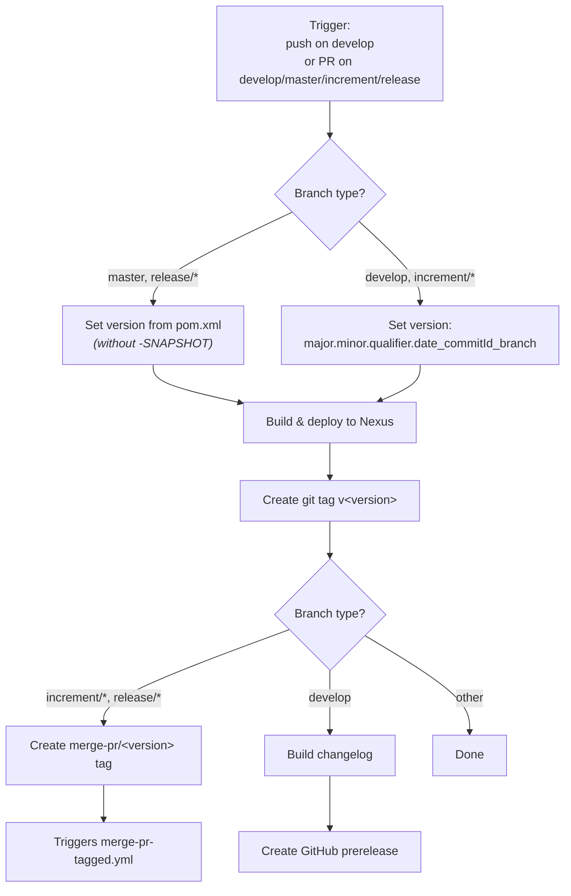
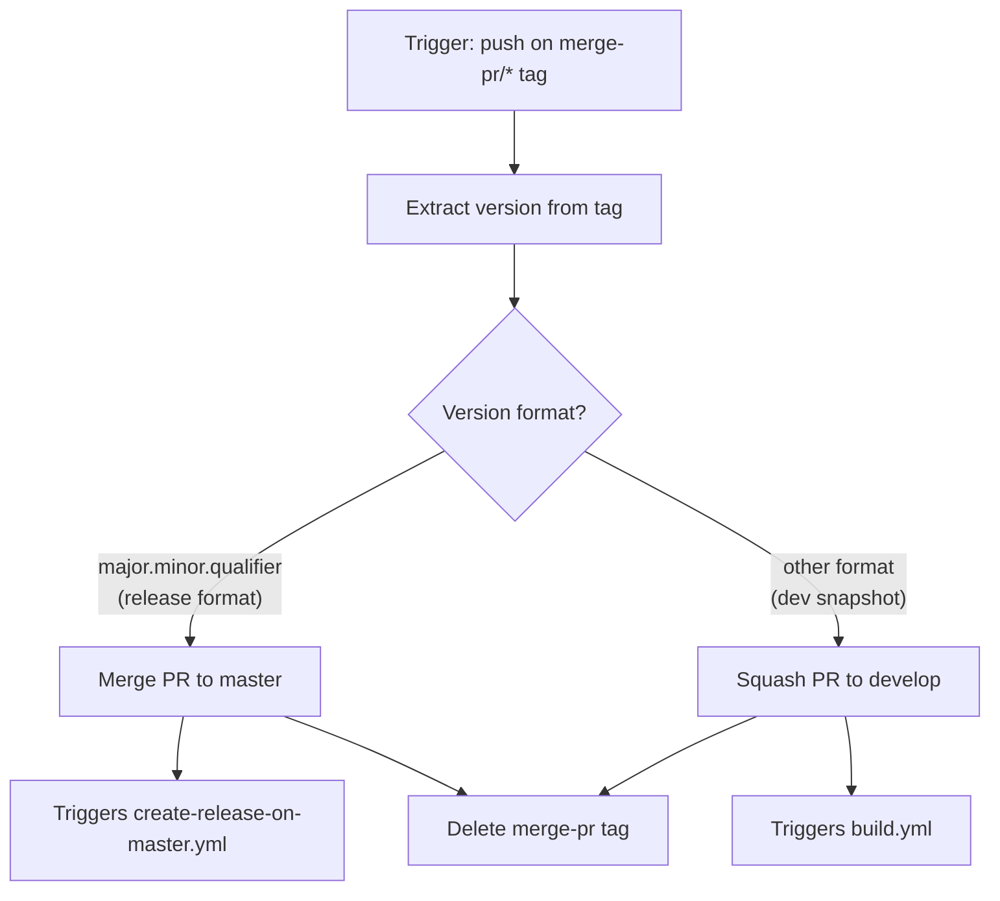
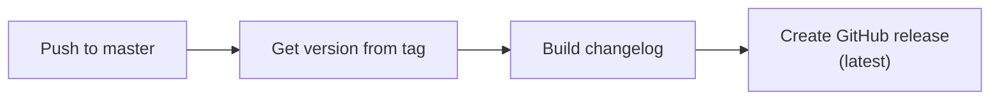
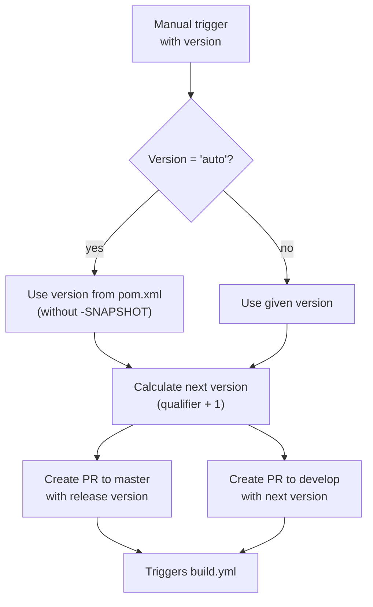

# Development Version and Branch Handling

## Branches

The versioning policy follows [GitFlow](https://www.atlassian.com/git/tutorials/comparing-workflows/gitflow-workflow). All development flows through a well-defined set of branch types, each with specific rules about when and how versions change.

```mermaid
gitGraph
    commit id: "init"
    branch develop
    checkout develop
    commit id: "dev-1"
    branch feature/JNG-1
    checkout feature/JNG-1
    commit id: "feat-1"
    commit id: "feat-2"
    checkout develop
    merge feature/JNG-1 id: "merge-feat-1"
    branch feature/JNG-3
    checkout feature/JNG-3
    commit id: "feat-3"
    checkout develop
    merge feature/JNG-3 id: "merge-feat-3"
    branch release/1.0-beta1
    checkout release/1.0-beta1
    commit id: "rc-1"
    branch bugfix/JNG-4
    checkout bugfix/JNG-4
    commit id: "fix-1"
    checkout release/1.0-beta1
    merge bugfix/JNG-4 id: "merge-fix"
    checkout develop
    merge release/1.0-beta1 id: "merge-release"
    checkout master
    merge release/1.0-beta1 id: "release-1.0"
```

| Branch Pattern | Base | Purpose |
|---|---|---|
| `develop` | — | Main development branch with latest sources of the active version |
| `feature/JNG-NUMBER_summary` | `develop` | New features for the next release |
| `(release/)X.Y.Z` | `develop` | Release candidates; the `release/` prefix is reserved for CI |
| `bugfix/JNG-NUMBER_summary` | release branch | Bug fixes applied during release testing; must also be applied to newer versions |
| `support/JNG-NUMBER_summary` | release branch | Minor changes to a previous release |
| `master` | — | Latest released sources |
| `hotfix/JNG-NUMBER_summary` | `master` | Emergency fixes applied to both release and master branches |

## Version Numbers

Version numbers follow semantic versioning with these rules:

| Event | Version Change |
|---|---|
| Start a `feature/` branch | No version change |
| Start a release branch from `develop` | 2nd number incremented on develop |
| Start a `bugfix/` branch | No version change (applied on release branch) |
| Start a `support/` branch | 3rd number incremented |
| Start a `hotfix/` branch | 4th number incremented |

## GitHub Actions Workflows

The CI/CD pipeline consists of several interconnected workflows that automate building, testing, releasing, and merging.

### build.yml — Main Build Pipeline

This is the primary workflow. It triggers on pushes to `develop` and pull requests targeting `develop`, `master`, `increment/*`, or `release/*` branches.



### merge-pr-tagged.yml — Automated PR Merging

Triggered when a `merge-pr/*` tag is pushed. Routes the merge based on version format:



### create-release-on-master.yml — Release Publishing

Triggered by pushes to `master`. Creates a GitHub release with a generated changelog.



### release.yml — Manual Release

Triggered manually with a version parameter. Creates pull requests for both the release and the next development version:



## Development Rules

> **Important:** There is no commit without a ticket number. Every pull request and commit must include a JIRA ticket reference in `JNG-xxx` format.

Issue tracking uses [JIRA](https://blackbelt.atlassian.net/jira/dashboards).
