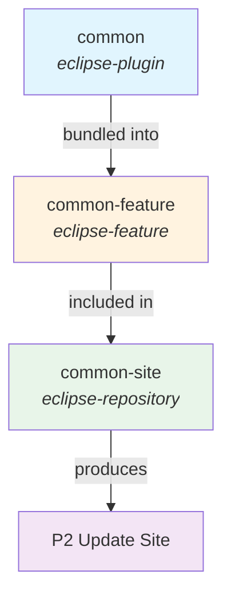
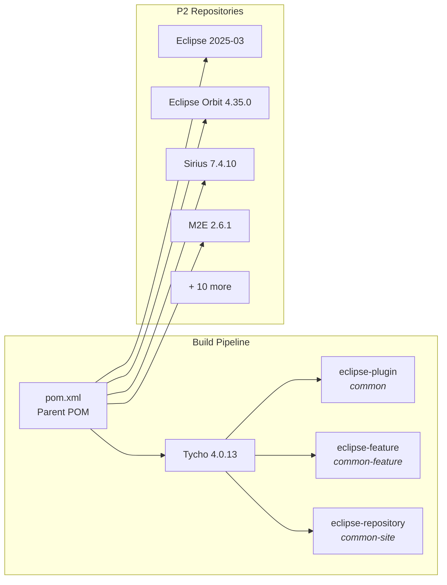
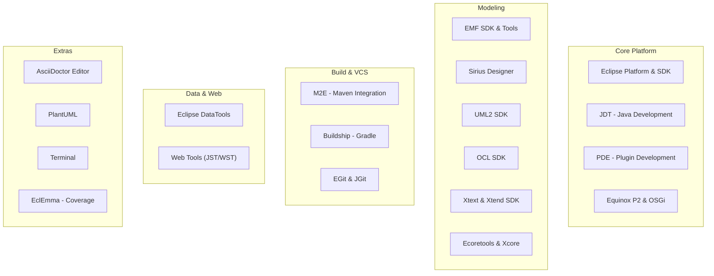

# judo-epp-common

[](https://github.com/BlackBeltTechnology/judo-epp-common/actions/workflows/build.yml)

JUDO Eclipse Packaging Project (EPP) Common is a mirror site and foundation for building JUDO Eclipse-based products. It assembles a curated set of Eclipse features and plugins into a P2 update site that can be used to install or extend Eclipse installations for JUDO development.

## Modules

The project is organized into three Maven/Tycho modules that form a layered build pipeline:



| Module | Packaging | Description |
|--------|-----------|-------------|
| `common` | `eclipse-plugin` | The main OSGi bundle (`hu.blackbelt.judo.eclipse.epp.package.common`). Contains the `ContributeHandler` command, splash screens, icons, and branding resources. |
| `common-feature` | `eclipse-feature` | Eclipse feature that bundles the common plugin together with Eclipse Platform, M2E Logback, and M2E PDE features. |
| `common-site` | `eclipse-repository` | P2 update site definition. Aggregates dozens of Eclipse features (EMF, Sirius, Xtext, JDT, M2E, EGit, DataTools, etc.) into a single installable repository. |

> **Note:** The `common-targetdefinition` module referenced in older documentation is currently disabled.

## Build

### Prerequisites

- **JDK 21** (Zulu JDK recommended)
- **Maven 3.9.9+** (or use the included Maven Wrapper)

### Commands

```bash
# Full build (all modules)
./mvnw clean install

# Build a single module
./mvnw -pl common clean install

# Skip tests
./mvnw clean install -DskipTests

# Build only the parent POM (skip all modules)
./mvnw -DskipModules=true clean install
```

### Build Architecture

The build uses **Tycho 4.0.13** to bridge Maven and Eclipse/OSGi. Dependencies are resolved from P2 repositories (not Maven Central) configured in the parent `pom.xml`. The target platform supports five environments:



| Target Platform | OS | Windowing | Architecture |
|---|---|---|---|
| Linux GTK | linux | gtk | x86_64, aarch64 |
| Windows | win32 | win32 | x86_64 |
| macOS Cocoa | macosx | cocoa | x86_64, aarch64 |

### Maven Profiles

| Profile | Purpose |
|---------|---------|
| `modules` | Default profile — includes common, common-feature, common-site modules |
| `sign-artifacts` | GPG-signs build artifacts for release |
| `release-judong` | Deploys to JUDO Nexus repository |
| `release-central` | Deploys to Maven Central (Sonatype OSSRH) |
| `release-dummy` | Deploys to local filesystem (for testing) |
| `generate-github-asciidoc-diagrams` | Generates HTML documentation with PlantUML diagrams |
| `update-source-code-license` | Updates EPL-2.0 license headers in source files |

## P2 Update Site Contents

The `common-site` module produces an update site containing a comprehensive set of Eclipse features organized into several categories:



## Contributing

Everyone is welcome to contribute! Please read [CONTRIBUTING.md](CONTRIBUTING.md) for details.

## License

This project is licensed under the [Eclipse Public License 2.0](https://www.eclipse.org/org/documents/epl-2.0/EPL-2.0.txt).
